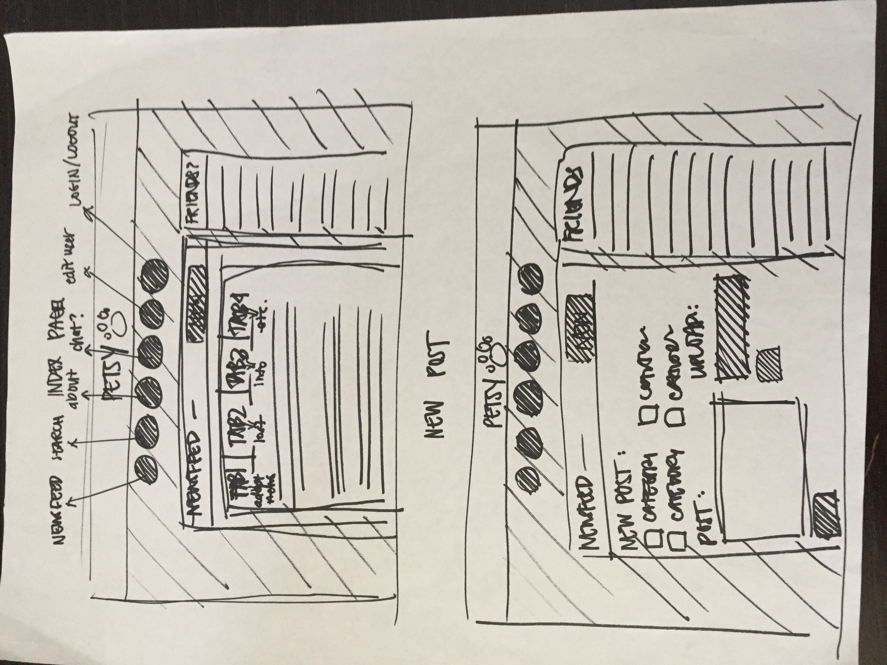
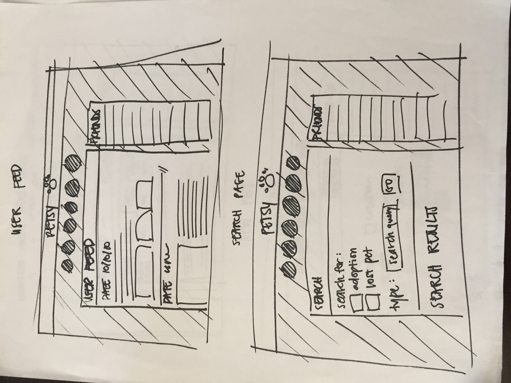

<h2><strong>Petsy</strong></h2>

Petsy is a listings app combined with social media features to provide a platform for users to connect over their love of animals and pets. The main feature of Petsy is the newsfeed, with a focus of lost & found pets, animals for adoption, and anything else pets-related.

Currently, a user is able to log in and post about a missing/found pet, pets for adoption, and more. Users are also able to view other users' posts on their newsfeed. In the very near future, Petsy would incorporate google maps API, in order to make the user experience more personal in terms of location. I will also implement a search function, in which users can search for their needs according to their location.

<h3>Technology:</h3>

Petsy was built using MEAN stack - MongoDB, Express, AngularJS, NodeJS. Petsy also incorporated Bootstrap and CSS for styling and functional purposes.

<h3>Wireframes:</h3>

